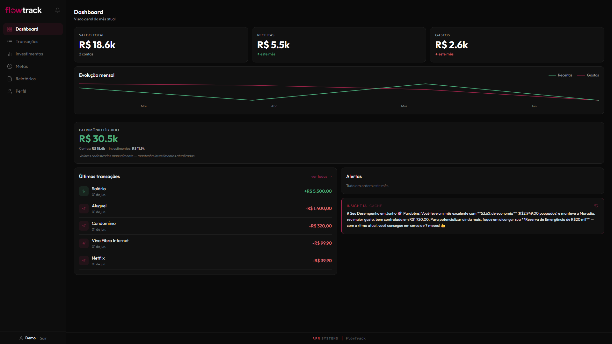
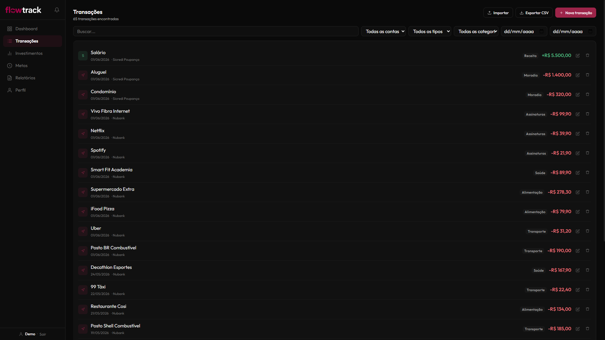
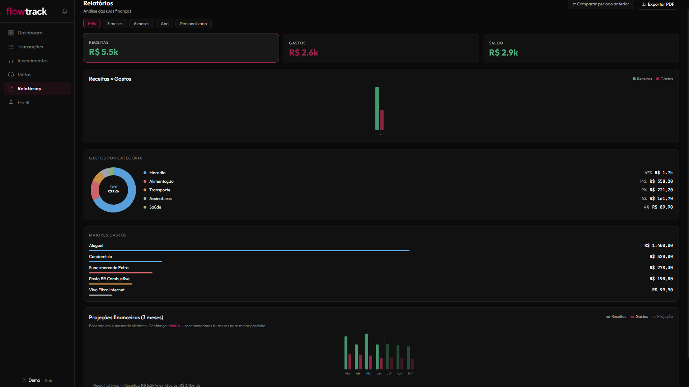
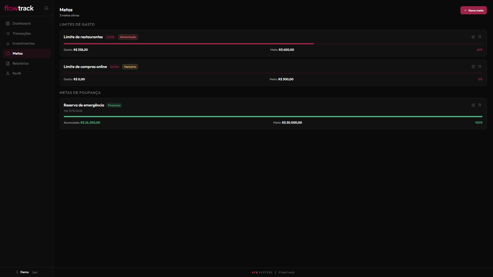
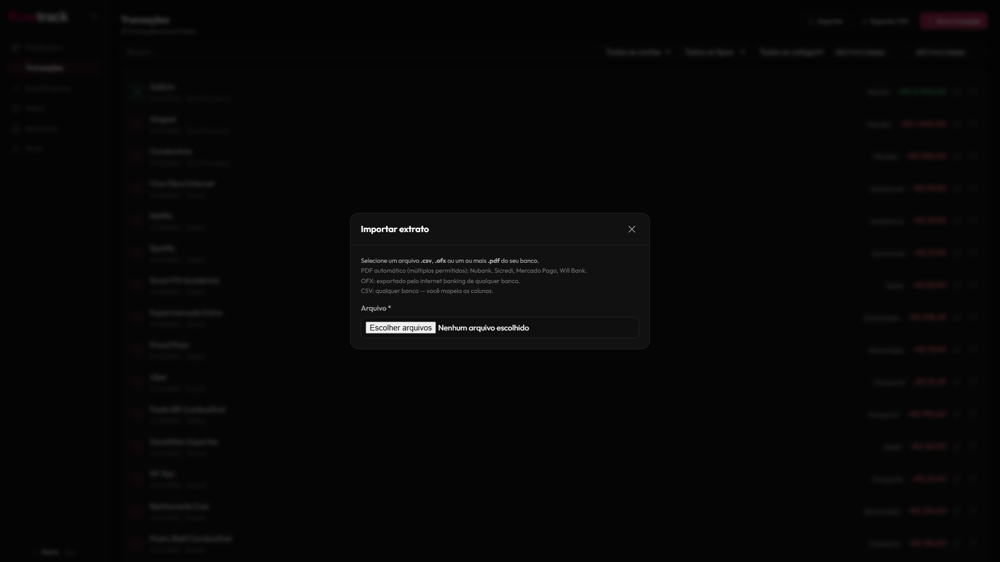
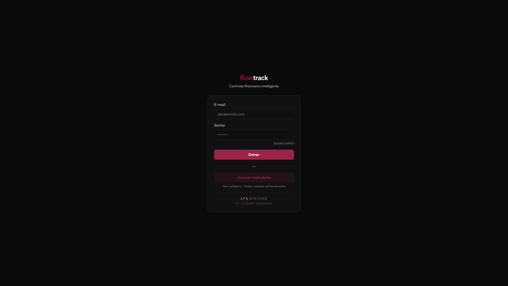
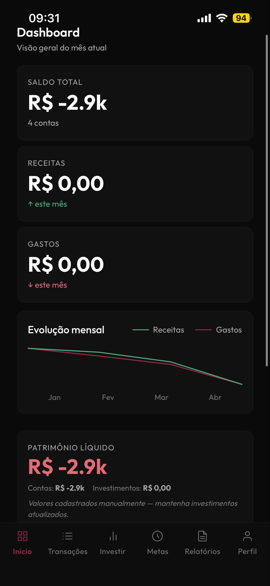

# FlowTrack

Personal finance app with AI-powered transaction categorization — built as a production-grade portfolio project targeting the European job market.

**Live demo → [flowtrack-afn.vercel.app](https://flowtrack-afn.vercel.app)**
_(Login: use the "Access demo mode" button — no sign-up required)_

---

## Screenshots

| | |
|---|---|
|  |  |
| Dashboard — metrics, cashflow, AI insight | Transactions — filters, category badges, installments |
|  |  |
| Reports — donut chart, bar chart, projections | Goals — progress bars, spending & savings targets |
|  |  |
| Import modal — PDF / OFX / CSV | Login — demo access, no sign-up required |

<details>
<summary>Mobile view</summary>



</details>

---

## What it does

FlowTrack is a full-featured personal finance tracker with a FastAPI backend, React frontend, and Claude Haiku for intelligent transaction categorization.

### Core features

| Area | Features |
|---|---|
| **Dashboard** | Monthly metrics (balance, income, expenses), 6-month net-balance sparkline, budget alerts, AI insight card |
| **Transactions** | CRUD with filters (debounced search, collapsible on mobile), pagination, inline category edit, installment badge ("3/6"), recurring tag |
| **Import** | PDF statements from 4 banks (Nubank, Sicredi, Mercado Pago, Will Bank), OFX, CSV — preview before confirming bulk import |
| **Transfers** | Atomic double-entry transfers between accounts with shared `import_batch_id` |
| **Budgets** | Monthly budget per category; automatic alerts at 80% and 100% consumption |
| **Tags** | Free-form labels on transactions, filterable in the list |
| **Goals** | Spending limits and savings targets with progress bars; auto-tracked from transactions |
| **Reports** | Donut chart by category, monthly bar chart, top 5 expenses, period comparison, PDF export |
| **Cashflow** | 12-month projected cashflow based on recurring transactions |
| **Net worth** | Historical snapshots with sparkline; liabilities subtracted from investment totals |
| **Investments** | Manual portfolio grouped by asset type with profitability metrics |
| **Audit log** | Every destructive action is logged and reversible (undo) |
| **AI insights** | On-demand financial insights via Claude Haiku |
| **Offline** | Transactions created offline sync on reconnect via IndexedDB queue + health-check ping |
| **PWA** | Installable on iOS, Android, and desktop |
| **Demo mode** | Pre-seeded account, weekly auto-reset via GitHub Actions |

### AI categorization — 3-layer pipeline

1. **Deterministic rules** — pattern matching for known payees (zero API cost)
2. **Merchant cache** — reuses prior Haiku decisions for the same merchant
3. **Claude Haiku** — fallback for unknown merchants (~90% call reduction vs. naive approach)

The worker is non-blocking with exponential backoff retry (1 min → 3 min → 9 min). Prompt caching on the system prompt reduces token cost per call.

---

## Tech Stack

### Frontend
| | |
|---|---|
| React 19 + TypeScript | UI framework |
| Vite 8 | Build tool |
| Zustand | Global state (auth + toasts) |
| Axios | HTTP client with JWT interceptor |
| Dexie.js | IndexedDB offline queue |
| @supabase/supabase-js | Auth + direct DB queries |

### Backend
| | |
|---|---|
| FastAPI + Python 3.11 | REST API |
| Supabase PostgreSQL | Database with Row Level Security |
| Supabase Auth | JWT authentication (ES256 / HS256 fallback, JWKS with 1h cache) |
| Claude Haiku | AI categorization with prompt caching |
| Structlog | Structured JSON logging |
| Sentry | Error monitoring |

### Infrastructure
| | |
|---|---|
| Vercel | Frontend hosting + auto-deploy |
| Railway | Backend hosting + auto-deploy |
| Supabase | PostgreSQL + auth (São Paulo region) |
| GitHub Actions | CI (typecheck + build) + weekly demo reset |
| cron-job.org | Triggers AI worker every 5 minutes |

---

## Architecture highlights

- **Security**: JWKS key lookup by `kid` header, ES256 + HS256 fallback, RLS as a second defense layer, service role isolated to backend. BOM-stripping on env vars prevents silent auth failures on Windows hosts.
- **Offline sync**: uses `window.addEventListener('online')` + health-check ping before processing the queue — no Background Sync API (Safari iOS doesn't support it).
- **No Tailwind / Shadcn**: custom design system in `tokens.css` with full dark/light support, typographic scale, responsive grid, and custom scrollbars. Deliberate choice documented in `docs/architecture.md`.
- **57 integration tests**: cover accounts CRUD, transactions CRUD, transfers (same-account guard), OFX parse, summary, cashflow, net worth, budget alerts.

---

## Getting Started

### Prerequisites
- Node.js 20+
- Python 3.11+
- A [Supabase](https://supabase.com) project

### 1. Clone & install

```bash
git clone https://github.com/alyssom-fernandes/FlowTrack.git
cd FlowTrack
npm install          # installs concurrently at root
cd frontend && npm install
```

### 2. Configure environment

```bash
# Frontend
cp frontend/.env.example frontend/.env.local

# Backend
cp backend/.env.example backend/.env
```

Fill in the values from your Supabase project dashboard and create a Python virtual environment:

```bash
cd backend
python -m venv .venv
.venv\Scripts\activate        # Windows
# source .venv/bin/activate   # macOS/Linux
pip install -r requirements.txt
```

### 3. Create the database schema

Run `docs/schema.sql` in the Supabase SQL Editor.

### 4. Seed demo data (optional)

```bash
cd backend
python demo_seed.py --full
```

### 5. Run

```bash
# From the repo root (with venv activated)
npm run dev
```

Frontend → `http://localhost:5173`  
Backend → `http://localhost:8000`  
API docs → `http://localhost:8000/docs`

---

## Environment Variables

### Frontend (`frontend/.env.local`)

| Variable | Description |
|---|---|
| `VITE_API_URL` | Backend URL (e.g. `http://localhost:8000`) |
| `VITE_SUPABASE_URL` | Your Supabase project URL |
| `VITE_SUPABASE_ANON_KEY` | Supabase anon/public key |
| `VITE_DEMO_EMAIL` | Demo account email |
| `VITE_DEMO_PASSWORD` | Demo account password |

### Backend (`backend/.env`)

| Variable | Description |
|---|---|
| `SUPABASE_URL` | Your Supabase project URL |
| `SUPABASE_ANON_KEY` | Supabase anon key |
| `SUPABASE_SERVICE_ROLE_KEY` | Supabase service role key (bypasses RLS) |
| `SUPABASE_JWT_SECRET` | JWT secret from Supabase dashboard |
| `ANTHROPIC_API_KEY` | Claude API key (optional — AI disabled if absent) |
| `INTERNAL_API_TOKEN` | Secret token for `/internal/*` endpoints |
| `CORS_ORIGINS` | Comma-separated allowed origins |
| `APP_ENV` | `development` or `production` |

---

## Deploy

Both platforms auto-deploy on push to `main`.

**Frontend (Vercel)**
- Root directory: `frontend/`
- Configuration: `frontend/vercel.json` (SPA rewrite rule)
- Set all `VITE_*` environment variables in Vercel dashboard

**Backend (Railway)**
- Root directory: `backend/`
- Configuration: `backend/railway.toml` + `backend/Procfile`
- Set all backend environment variables in Railway dashboard

**AI Categorization worker**
- Set up a POST cron at [cron-job.org](https://cron-job.org) every 5 minutes:
  - URL: `<RAILWAY_URL>/internal/process-queue`
  - Header: `X-Internal-Secret: <INTERNAL_API_TOKEN>`

---

## Project Structure

```
FlowTrack/
├── frontend/               React + TypeScript + Vite
│   ├── src/
│   │   ├── pages/          Dashboard, Transactions, Goals, Investments, Reports, Profile
│   │   ├── components/     AppShell, Sidebar, UI primitives (ui.tsx, layout.tsx)
│   │   ├── services.ts     Supabase client + Axios API services
│   │   ├── store.ts        Zustand stores + Dexie offline queue
│   │   ├── utils.ts        Formatters, normalizers, useOnlineStatus
│   │   └── tokens.css      Design system tokens (dark/light, typography, grid)
│   └── vercel.json
├── backend/                FastAPI + Python 3.11
│   ├── app/
│   │   ├── api/v1/         All REST endpoints (routers.py)
│   │   ├── core/           Config, DB client, JWT security, logging
│   │   └── integrations/   Claude Haiku categorization worker
│   ├── tests/              57 integration tests (pytest)
│   ├── demo_seed.py        Demo data seeder with smart reset
│   └── railway.toml
├── docs/
│   ├── schema.sql          Full Supabase PostgreSQL schema
│   ├── architecture.md     Design decisions and trade-offs
│   └── parsers.md          PDF bank parser documentation
└── .github/workflows/
    ├── ci.yml              Typecheck + build on every push
    └── demo-reset.yml      Weekly demo data reset (Monday 06:00 UTC)
```

---

## Author

**Alyssom Fernandes** — AFN SYSTEMS  
[github.com/alyssom-fernandes](https://github.com/alyssom-fernandes)
