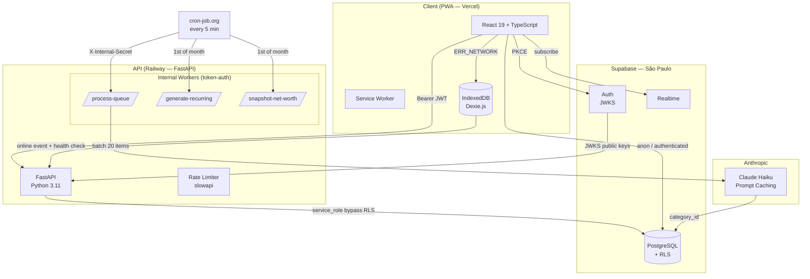

# FlowTrack — Architecture

## Overview

FlowTrack is a personal finance PWA built as a monorepo with a React + TypeScript frontend and a FastAPI Python backend, backed by Supabase (PostgreSQL + Auth).

---

## System Diagram

---

## Stack

| Layer | Technology | Reason |
|---|---|---|
| Frontend | React 19 + TypeScript + Vite | Modern, typed, fast DX |
| State | Zustand | Lightweight, no boilerplate |
| Offline queue | Dexie.js (IndexedDB) | Better API than raw IndexedDB |
| HTTP client | Axios | Interceptors for JWT + 401 handling |
| Backend | FastAPI (Python 3.11) | Modern, typed, auto Swagger |
| Database | Supabase (PostgreSQL) | Auth + DB + RLS in one service |
| Auth | Supabase Auth + JWKS | No custom JWT implementation |
| AI | Claude Haiku + Prompt Caching | Cost-efficient categorization |
| Rate limiting | slowapi | Protects import and AI endpoints |
| Frontend hosting | Vercel | Native React support, auto-deploy |
| Backend hosting | Railway | No aggressive cold starts |
| Monitoring | Sentry + structlog | Errors + structured JSON logs |

---

## Key Architectural Decisions

### Hybrid AI Categorization (3-Layer Pipeline)

Transactions go through three layers before hitting the Claude API:

1. **Deterministic rules** — pattern matching for known payees (zero API cost)
2. **`merchant_cache` lookup** — normalized description → category, per-user + global rules
3. **Claude Haiku with Prompt Caching** — only for unresolved cases; system prompt cached via `cache_control: ephemeral`

This reduces API calls by ~90% after initial warmup. The merchant cache is populated from AI decisions and manual corrections, self-improving over time.

### Non-Blocking Categorization

Transactions are saved immediately. A background worker processes the `categorization_queue` table every 5 minutes via cron-job.org → `POST /internal/process-queue`. The frontend receives updates via Supabase Realtime subscription.

### Offline-First PWA

Transactions created offline are stored in IndexedDB (Dexie.js) with `sync_status: pending`. When connectivity is restored:

1. `window.addEventListener('online')` fires
2. A health-check ping (`GET /health`) confirms the API is reachable
3. Pending items are processed with exponential backoff: 1 min → 3 min → 9 min (max 3 retries)

**Background Sync API was intentionally avoided** — it has no support on iOS Safari, which represents a significant share of mobile users. The `online` event approach works across all browsers including iOS Safari 14+.

### CSV Import Architecture

CSV files are parsed entirely client-side (browser FileReader API). The user maps columns (date, description, amount) in a modal UI, then the parsed transactions are sent to `POST /api/v1/transactions/bulk`. This avoids file uploads for CSV and removes server-side parsing complexity. PDF and OFX files are sent to the backend for parsing due to their binary/structured format complexity.

### Balance Adjustment — Intentional Non-Atomicity

`_adjust_account_balance()` in `_helpers.py` performs a read-then-write (fetch current balance → compute new balance → update). This is technically non-atomic and would be a risk in a multi-user or high-concurrency system.

**Why this is acceptable here:** FlowTrack is a single-user personal finance app. Supabase RLS policies ensure each user only touches their own `accounts` rows, making concurrent writes from different users impossible. Concurrent writes from the *same* user are extremely unlikely in a personal finance context. A PostgreSQL `UPDATE accounts SET balance = balance + $delta WHERE id = $id` would be the production-scale solution if this assumption ever changes.

### Security Layers

- **JWT validation**: JWKS public key lookup by `kid` header, 1-hour cache. Supports ES256 (Supabase default) with HS256 fallback for legacy tokens.
- **RLS**: Row Level Security on all tables as a second defense layer. The backend uses service role but always filters by `user_id` manually — RLS is a safety net, not the primary guard.
- **Internal endpoints**: Protected by `X-Internal-Secret` header (`verify_internal_token`). cron-job.org calls these; no JWT required.
- **Rate limiting**: `slowapi` on import endpoints (10/min) and AI insights (5/min).
- **BOM stripping**: Pydantic validator strips UTF-8/UTF-16 BOM from env var values — prevents silent auth failures when `.env` files are edited on Windows.

### Insight Cache — In-Memory Trade-Off

AI-generated insights are cached for 24 hours in a module-level dict (`_insights_cache`). This works correctly for Railway's single-worker deployment. If Railway scales to multiple workers, each worker has an independent cache, which may cause duplicate Claude calls within the 24h window. Acceptable for personal use volume; a Supabase table with a `generated_at` column would be the multi-worker solution.

---

## Rejected Decisions

| Decision | Reason |
|---|---|
| Next.js | SSR unnecessary for auth-gated SPA |
| Turborepo / Nx | Overhead for a solo project |
| Shadcn UI / Tailwind | Intentional custom CSS tokens for visual identity and learning |
| TanStack Query | Zustand + Axios sufficient; avoids another abstraction layer |
| Celery + Redis | `categorization_queue` table in Supabase handles the volume |
| Background Sync API | Not supported on iOS Safari |
| Prisma / SQLAlchemy | Supabase client direct queries are sufficient |
| Gunicorn multi-worker | Railway single-worker; revisit if traffic grows |
